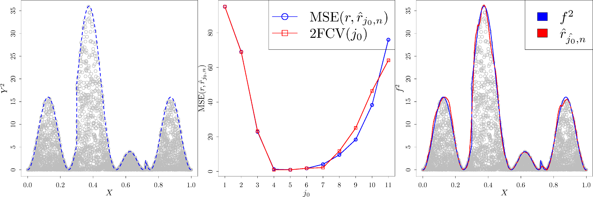

## Boundary estimation using a linear wavelet approach

This is the code to reproduce all the experiments presented in the paper

**C. Chesneau, J. Kou and F. Navarro
 
[Linear wavelet estimation in regression with additive and multiplicative noise](https://hal.archives-ouvertes.fr/hal-01877543v2/document)**
 

### Requirements
* [rwavelet](https://github.com/fabnavarro/rwavelet)

Copyright (c) 2018 C. Chesneau, J. Kou and F. Navarro
